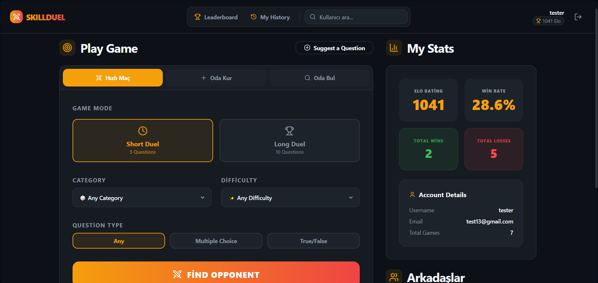
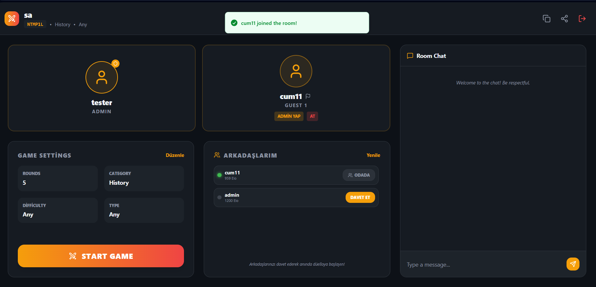
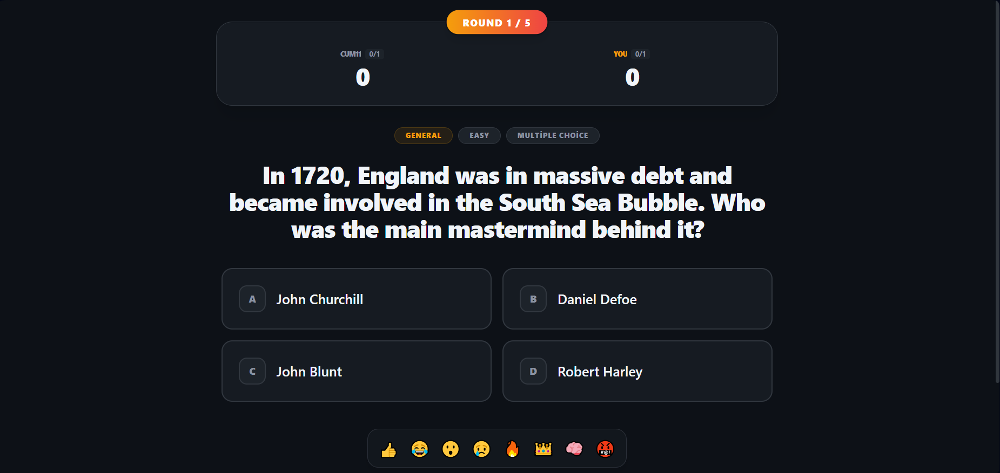
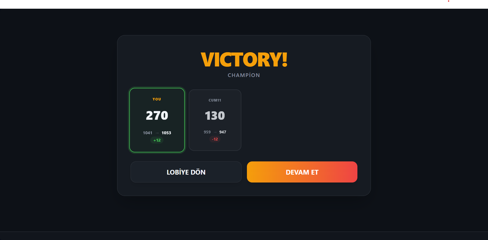
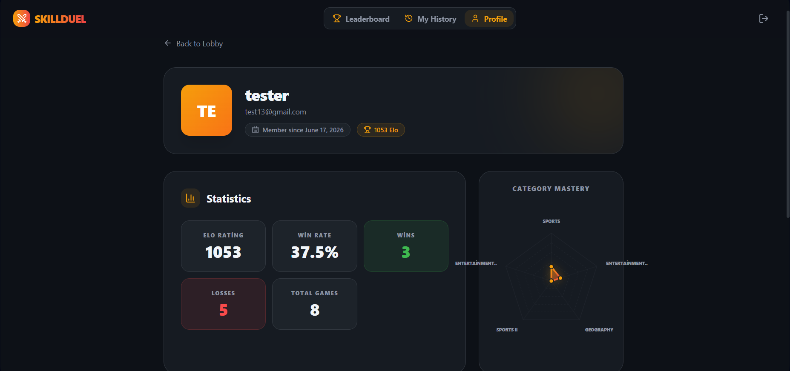

# SkillDuel ⚔️

**Gerçek zamanlı 1v1 bilgi yarışması düello platformu.** Rakip bul, baskı altında soruları yanıtla ve Elo sıralamasında yüksel.

> .NET 8, SignalR, Redis ve Next.js 14 ile geliştirildi.

---

## Ekran Görüntüleri

| Ana Sayfa | Oda |
|-----------|-----|
|  |  |

| Oyun | Maç Sonu |
|------|----------|
|  |  |

| Profil |
|--------|
|  |

---

## Özellikler

- **Gerçek zamanlı oyun döngüsü** — SignalR WebSocket üzerinden senkronize akış. Her iki oyuncu da soruları, skorları ve geri sayımı eş zamanlı görür.
- **Elo derecelendirme sistemi** — Galibiyet/mağlubiyet sonucuna göre puan dinamik olarak değişir. Maç sonu ekranında her iki oyuncunun Elo değişimi ayrı ayrı gösterilir.
- **Eşleştirme sistemi** — Hızlı maç modu, Redis tabanlı kuyruk (BLPOP) aracılığıyla otomatik rakip bulur. Oda sistemi ile davet linki üzerinden özel lobi kurulabilir.
- **Oda yönetimi** — Admin oyuncu atabilir/yasaklayabilir, admin rolünü devredebilir ve maç öncesinde tur sayısı, kategori, zorluk ile soru türünü yapılandırabilir.
- **Arkadaş sistemi** — Arkadaş ekle, çevrimiçi durumunu gör, arkadaş listesinden doğrudan odaya davet et.
- **Oda sohbeti** — Oyun başlamadan önce lobide gerçek zamanlı sohbet.
- **Tepki sistemi** — Oyun sırasında rakibe emoji tepkileri gönder.
- **Soru havuzu** — OpenTDB API'dan çekilen sorular, arka plan işleri aracılığıyla PostgreSQL'e aktarılır.
- **Sıralama & geçmiş** — Elo bazlı global sıralama tablosu ve kişisel maç geçmişi.
- **Kategori hakimiyeti** — Profil sayfasında kategoriye göre performans istatistikleri.

---

## Teknoloji Yığını

### Backend
| Katman | Teknoloji |
|--------|-----------|
| Runtime | .NET 8 Web API |
| Gerçek zamanlı | ASP.NET Core SignalR |
| Arka plan işleri | Hangfire |
| Veritabanı | PostgreSQL |
| Önbellek / Kuyruk | Upstash Redis (BLPOP tabanlı eşleştirme) |
| Kimlik doğrulama | JWT Bearer |

### Frontend
| Katman | Teknoloji |
|--------|-----------|
| Framework | Next.js 14 (App Router) |
| UI | Shadcn/UI + Tailwind CSS |
| Gerçek zamanlı | SignalR JS istemcisi |

---

## Mimari

```
┌─────────────────────────────────────────────┐
│                  Next.js 14                  │
│              (SSR + İstemci)                 │
└───────────────────┬─────────────────────────┘
                    │ HTTP + WebSocket (SignalR)
┌───────────────────▼─────────────────────────┐
│              .NET 8 Web API                  │
│  ┌──────────┐  ┌──────────┐  ┌───────────┐  │
│  │SignalR   │  │Hangfire  │  │REST API   │  │
│  │GameHub   │  │Jobs      │  │Controller │  │
│  └──────────┘  └──────────┘  └───────────┘  │
└──────┬─────────────────┬────────────────────┘
       │                 │
┌──────▼──────┐   ┌──────▼──────┐
│  PostgreSQL │   │ Upstash      │
│             │   │ Redis        │
│  Users      │   │ (Eşleştirme │
│  Questions  │   │  Kuyruğu)   │
│  Matches    │   └─────────────┘
│  Elo History│
└─────────────┘
```

### Temel mimari kararlar

**Redis BLPOP ile eşleştirme** — Polling yerine `BLPOP` kullanılarak kuyrukta bloke-bekleme yapılır. Bu yaklaşım boşta döngüyü ortadan kaldırır ve Upstash ücretsiz katman hız limitlerini aşmaz.

**SignalR tek doğruluk kaynağı** — Tüm oyun durumu geçişleri (soru başlangıcı, cevap alındı, tur sonu, maç sonucu) sunucu tarafındaki SignalR olayları ile yönetilir. İstemci tamamen reaktiftir; istemci tarafında zamanlayıcı veya skor hesaplaması yoktur.

**Hangfire arka plan işleri** — OpenTDB'den soru aktarımı, zaman aşımı sonrası lobi temizliği ve Elo güncellemeleri istek iş parçacıklarını bloke etmeden arka planda çalışır.

---

## Kurulum

### Gereksinimler
- .NET 8 SDK
- Node.js 18+
- PostgreSQL
- Redis (veya Upstash hesabı)

### Backend

```bash
cd backend
cp .env.example .env
# .env dosyasını doldur: veritabanı bağlantısı, Redis, JWT

dotnet restore
dotnet ef database update
dotnet run
```

### Frontend

```bash
cd web
cp .env.example .env.local
# .env.local dosyasını doldur: NEXT_PUBLIC_API_URL, NEXT_PUBLIC_HUB_URL

npm install
npm run dev
```

---

## Ortam Değişkenleri

### Backend (`.env`)
```
DATABASE_URL=Host=...;Database=skillduel;Username=...;Password=...
REDIS_URL=rediss://...upstash.io:6380,password=...
JWT_SECRET=...
JWT_ISSUER=SkillDuel
JWT_AUDIENCE=SkillDuel
```

### Frontend (`.env.local`)
```
NEXT_PUBLIC_API_URL=https://your-backend-url
NEXT_PUBLIC_HUB_URL=https://your-backend-url/hubs/game
```

---

## Proje Yapısı

```
SkillDuel/
├── backend/
│   ├── Hubs/              # SignalR GameHub
│   ├── Controllers/       # REST endpoint'leri
│   ├── Services/          # Eşleştirme, Elo, Oda mantığı
│   ├── Jobs/              # Hangfire arka plan işleri
│   ├── Models/            # Domain varlıkları
│   └── Data/              # EF Core DbContext, migration'lar
└── web/
    ├── app/               # Next.js App Router sayfaları
    ├── components/        # UI bileşenleri (Shadcn)
    ├── hooks/             # SignalR bağlantı hook'ları
    └── lib/               # API istemcisi, yardımcılar
```

---

## Yol Haritası

- [ ] Turnuva modu (bracket sistemi, çok oyunculu)
- [ ] Özel soru paketleri (kullanıcı tarafından oluşturulan)
- [ ] Mobil uygulama (React Native)
- [ ] İzleyici modu

---

## Lisans

[MIT](LICENSE)
